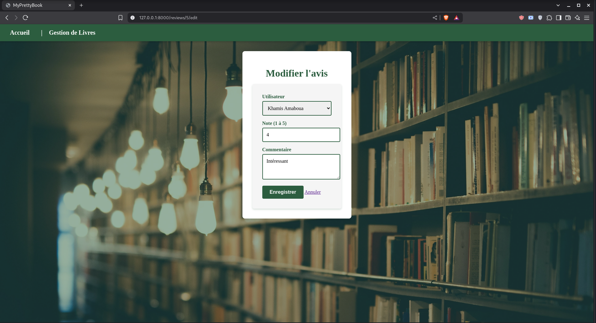

# Application de Gestion de Livres et Avis - Laravel (MyPrettyBook)

---

## Présentation du projet

Cette application Laravel permet de gérer une bibliothèque virtuelle où les utilisateurs peuvent consulter une liste de livres, voir les détails de chaque livre, ainsi que consulter et ajouter des avis avec une note (1 à 5 étoiles). Le design s'inspire des ambiances de bibliothèque avec une interface claire, accessible et responsive.

---

## Fonctionnalités principales

- Affichage paginé (6 livres par page) de livres sous forme de cartes avec titre, auteur et note moyenne.
- Page détails d’un livre avec présentation complète, liste des avis et formulaire d’ajout d’avis.
- Modification des avis existants par les utilisateurs.
- Affichage dynamique des notes moyennes ; affichage "Aucune note" si aucun avis.
- Pagination claire avec mise en surbrillance de la page active.
- Page d’accueil différente de la liste des livres.
- Styles personnalisés rappelant la forêt et l’ambiance bibliothèque.
- Page 404 personnalisée.
  
---

## Prérequis

- PHP >= 8.1
- Composer
- Serveur web (ex: Apache, Nginx) ou serveur intégré Laravel (`php artisan serve`)
- Système de gestion de base de données compatible MySQL/MariaDB
- Node.js & npm (optionnel si compilation assets frontend)

---

## Installation détaillée

### 1. Cloner le dépôt

    git clone https://github.com/amabouak/MyPrettyBook

    cd MyPrettyBook

2. Installer les dépendances PHP avec Composer

        composer install

3. Configurer l’environnement

Copier le fichier .env.example en .env :

    cp .env.example .env

Modifier le fichier .env pour configurer la connexion à la base de données :

    DB_CONNECTION=mysql
    DB_HOST=127.0.0.1
    DB_PORT=3306
    DB_DATABASE=nom_de_votre_base
    DB_USERNAME=votre_utilisateur
    DB_PASSWORD=mot_de_passe

4. Générer la clé d’application

       php artisan key:generate

5. Créer la base de données

Créer la base de données spécifiée dans .env via phpMyAdmin, MySQL CLI ou outil dédié :

    CREATE DATABASE nom_de_votre_base;

6. Exécuter les migrations et seeders

Appliquer les migrations pour créer les tables :

        php artisan migrate

Exécuter les seeders pour injecter les données initiales (livres et utilisateurs) :

    php artisan db:seed --class=BooksTableSeeder
    php artisan db:seed --class=UsersTableSeeder

7. Lancer le serveur de développement

        php artisan serve    

L’application sera accessible par défaut sur http://127.0.0.1:8000

Structure du projet

    app/Models : Contient les modèles Eloquent Book, Review et User avec leurs relations.
    app/Http/Controllers : Contient les contrôleurs BookController pour la gestion des livres et ReviewController pour les avis.
    resources/views : Vues Blade structurant le front-end.
    layouts/app.blade.php : Layout principal avec le style global.
    books/index.blade.php : Liste paginée des livres affichée en cartes.
    books/show.blade.php : Page détails d’un livre avec avis et formulaire.
    reviews/edit.blade.php : Formulaire d’édition d’un avis.
    welcome.blade.php : Page d’accueil personnalisée.
    errors/404.blade.php : Page 404 personnalisée.
    database/migrations : Migrations définissant les tables books, reviews, users.
    database/seeders : Seeders pour remplir la base avec des livres et utilisateurs de test.
    routes/web.php : Définition des routes web et endpoints.

Utilisation

    Accéder à la page d’accueil : / (page d’introduction avec bouton vers la liste).
    Consulter la liste des livres : /books (affichage paginé en grille 3x2).
    Visualiser détails d’un livre : /books/{id}.
    Ajouter un avis sur la page détail d’un livre.
    Modifier un avis existant via le lien “Modifier” sur la page détail.
    Pagination dynamique avec mise en surbrillance du numéro actif.
    Accès aux pages inexistantes affiche la page 404 personnalisée.

Personnalisation

    Le style est basé sur des couleurs vert forêt rappelant l’ambiance calme des bibliothèques.
    L’image de fond peut être ajoutée dans public/images pour personnalisation visuelle.
    Le système peut être étendu avec authentification, upload PDF, recherche, etc.

Dépendances principales

    Laravel Framework 12.x
    PHP 8.1+
    La pagination et routing natifs Laravel sont utilisés.
    Pas de framework CSS externe, design custom en CSS pur.

Remarques

    Le mot de passe des utilisateurs de test est : password123
    Les avis ne nécessitent pas d’authentification dans cette version.
    La pagination est configurée pour 6 livres par page.
    Le projet est compatible mobile et responsive.

# Captures d'écrans 

## Page d'accueil

## Menu Liste Livres 1

## Menu Liste Livres 2

## Menu Liste Livres 3

## Menu Liste Livres 4

## Détail du livre + formulaire d'avis

## Remplissage du formulaire d'avis

## Ajout d'un avis

## Formulaire de modification

## Modification d'un avis

## Modification du menu des livres après ajout d'un avis

## Base de donnée du projet 

## Affichage de la liste des utilisateurs présents dans la base de donnée du projet 

## Support et contribution

N’hésitez pas à faire remonter des bugs ou suggestions via issues GitHub, ou à proposer vos améliorations via pull requests.
